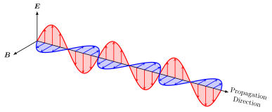
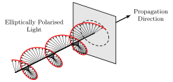



# Applications of electrodynamics {#sec-applications-electrodynamics}

::: {.callout-tip}

## Aims of the chapter

By the end of this chapter, you should be able to:

* Calculate solutions to the wave equation for monochromatic plane waves.
* Explain the phenomenon of light polarisation.
* Explain the reflection of electromagnetic waves on a conductor.
* Calculate the magnetostatic energy of a current distribution, and explain the concept of inductance.
* Calculate the current induced by a varying magnetic flux.
:::

In the previous chapter we introduced the time dependency on Maxwell's equations, and derived the wave equation from them. These equations allow us to explain a huge variety of phenomena, such as electromagnetic induction and the behaviour of light. This is the goal of this chapter.

## Solving the wave equation

From the Maxwell's equations we derived the wave equation for both the electric and magnetic fields (@eq-wave-E and @eq-wave-B). The wave equation is a second-order linear partial differential equation, and we could solve it using the method of separation of variables. We will not go into the details of this method, but we will just show how to obtain a particular solution of the wave equation, which is the plane wave solution.

Plane waves are waves that only depend on one spatial variable, say (wlog) $x$, and time $t$, and, by construction, they are constant in the $yz$-plane for fixed $x$ and $t$. Consider Gauss' law (in the absence of any charges) for this type of waves:

$$\nabla \cdot \bfE = \frac{\partial E_x}{\partial x} = 0.$$

Then $E_x$ must be constant, and we can set it to zero without loss of generality. Therefore, the electric field of a plane wave must be perpendicular to the direction of propagation (which is the $x$-axis in this case). We assume it takes the form
$\bfE = E(x,t) \bfe_y$, so @eq-wave-E reduced to

$$\frac{1}{c^2} \frac{\partial^2 E}{\partial t^2} - \frac{\partial^2 E}{\partial x^2} = 0.$$

The most general form to the solution of this equation is 

$$E(x,t) = f(x - ct) + g(x + ct),$$

where $f$ and $g$ are arbitrary functions. This solution represents two waves, one travelling to the right (the $f$ term) and one travelling to the left (the $g$ term). 

Within the plane wave solutions, we can study a particular class: monochromatic waves. These are oscillating waves with a single frequency $\omega$. Take

$$E(x,t) = E_0 \sin\left(\omega \left( \frac{x}{c} - t\right) \right),$$

where $E_0$ is the amplitude of the wave. It is often more convenient to write this solution as

$$E(x,t) = E_0 \sin(kx - \omega t),$$

where $k$ is called the _wavenumber_ and is related to $\omega$ by the relation $\omega = k \; c$, which is called the _dispersion relation_ of the wave. 

There are some associated quantities which are very useful from a physics perspective:

* To be proper, we should refer to $\omega$ as the _angular frequency_, and define the _frequency_ as 

$$\nu = \omega / (2\pi),$$ 

which is the number of oscillations per unit time. However, we will only work with $\omega$ in these notes, so we will just call it frequency.

* The _period_ of oscillation is defined as 
$$T = 1/\nu = 2\pi/\omega,$$ 

and is the time it takes for a wave to complete an oscillation.

* The _wavelength_ $\lambda$ is defined as the distance between two consecutive peaks of the wave, and is given by 

$$\lambda = 2\pi/k.$$

Now let's consider the magnetic field. Using Faraday's law @eq-Maxwell-2-bis, we can write

$$\bfB = B(x,t) \bfe_z,$$

with

$$\frac{\partial B}{\partial t} = - \frac{\partial E}{\partial x} = -k E_0 \cos(kx - \omega t).$$

Integrating $B$ with respect to time, we obtain

$$B(x, t) = \frac{E_0}{c} \sin(kx - \omega t).$$

We have ignored the integration constant, we will talk about those (which are basically shifts in the phase of the wave) when we talk about polarisation of waves.

{#fig-plane-wave width=80%}

From the expressions for $\bfE$ and $\bfB$, we can see that, as shown in @fig-plane-wave the electric and magnetic fields oscillate in phase, but perpendicular to each other, and to the direction of propagation of the wave. The results we have derived are for a single frequency, but by linearity of the Maxwell's equations (or, if you prefer, by the principle of superposition) we can construct more complicated solutions by adding together monochromatic waves of different frequencies. This is how we can explain the behaviour of light, which is a superposition of waves of different frequencies (or, equivalently, different wavelengths).

By convenience, we can switch to complex notation, and write the electric and magnetic fields as

$$\bfE(x, t) = E_0 \bfe_y e^{i(kx - \omega t)}, \quad \text{and} \quad \bfB(x, t) = \frac{E_0}{c} \bfe_z e^{i(kx - \omega t)}.$$

As long as we work with linear equations, we are guaranteed that both the real and imaginary parts are solutions to the wave equation, and so will be any linear combination of them.

## Light polarisation {#sec-light-polarisation}

We can now further generalise our wave solutions by allowing the wave to travel and oscillate in arbitrary directions. Then, the solutions can be written as

$$\bfE(\bfr, t) = \bfE_0 e^{i(\bfk \cdot \bfr - \omega t)}, \quad \text{and} \quad \bfB(\bfr, t) = \bfB_0 e^{i(\bfk \cdot \bfr - \omega t)}.$$ {#eq-plane-wave-complex}

Here, $\bfE_0$ and $\bfB_0$ can be complex-valued vectors, and the vector $\bfk$ is called the _wavevector_, with $|\bfk| = k$. The dispersion relation $\omega = c k$ still holds, but we need some additional constraints on $\bfE_0$, $\bfB_0$ and $\bfk$. From the Maxwell's equations we obtain

$$\begin{aligned}
\nabla \cdot \bfE &= 0, & \implies \bfk \cdot \bfE_0 &= 0, \\
\nabla \cdot \bfB &= 0, & \implies \bfk \cdot \bfB_0 &= 0, \\
\nabla \times \bfE &= -\frac{\partial \bfB}{\partial t}, & \implies \bfk \times \bfE_0 &= \omega \bfB_0,
\end{aligned}$$

and you can check that the remaining Maxwell's equation is automatically satisfied (and, in fact, the first and second relations can each be deduced from the other two). The first and second relations tell us that the electric and magnetic fields are perpendicular to the direction of propagation of the wave $\bfk$, respectively, while the last relation tells us that $\bfE_0$ and $\bfB_0$ are perpendicular to each other, and that their magnitudes are related by $|\bfB_0| = |\bfE_0|/c$. This means that electromagnetic waves are _transverse waves_ (or transversely polarised), as they oscillate in a direction perpendicular to the direction of propagation.^[This is in contrast to longitudinal waves, which oscillate in the direction of propagation, like sound waves.]

These results will allow us to study the phenomenon of light polarisation. The first type of polarisation we will look at is linear polarisation. Let's assume that both $\bfE_0$ and $\bfB_0$ are real-valued vectors. Then, we have that the electric field oscillates in the $\bfE_0$ direction, and the magnetic field oscillates in the $\bfB_0$ direction, which is perpendicular to $\bfE_0$. The two vectors satisfy

$$\bfk \times \bfE_0 = \omega \bfB_0,$$

or, rearranging using the dispersion relation

$$\hat{\bfk} \times \left( \frac{\bfE_0}{c} \right) = \bfB_0,$$

where $\hat{\bfk} = \bfk / k$ is the unit vector in the direction of propagation. This means that $\bfE_0$, $\bfB_0$ and $\hat{\bfk}$ form a right-handed orthogonal basis, and so the electric and magnetic fields oscillate in fixed directions, which are perpendicular to each other and to the direction of propagation. This is what we call _linearly polarised light_.

The next type of polarisation we will look at is elliptic polarisation (of which circular polarisation is a special case). Suppose now that $\bfE_0$ and $\bfB_0$ are complex-valued vectors. The actual electric and magnetic fields are given by the real parts of @eq-plane-wave-complex, but the polarisation of the wave now does not point in a fixed direction.

Consider now two orthogonal unit vectors $\bfe_1$ and $\bfe_2$, such that $\bfe_1 \times \bfe_2 = \hat{\bfk}$. Then, we can express

$$\bfE_0 = \alpha_1 e^{i \delta_1} \bfe_1 - i \alpha_2 e^{i \delta_2} \bfe_2,$$

where $\alpha_1, \alpha_2 \in \mathbb{R}$ are the magnitudes and  $\delta_1,\delta_2 \in \mathbb{R}$ are the phases complex phases. Then, the real part of the electric field (i.e. the actual electric field) is given by

$$\bfE(\bfr, t) = \alpha_1 \cos(\bfk \cdot \bfr - \omega t + \delta_1) \bfe_1 + \alpha_2 \sin(\bfk \cdot \bfr - \omega t + \delta_2) \bfe_2.$$

If either $\alpha_1$ or $\alpha_2$ is zero, then the wave is linearly polarised. If both $\alpha_1$ and $\alpha_2$ are non-zero, then we have a more interesting behaviour. To better understand what is going on, let's fix the position $\bfr$ to an arbitrary point and look at the electric field as a function of time. Taking $\bfr = \bfzero$ we have

$$\bfE(\bfzero, t) = \alpha_1 \cos(\omega t - \delta_1) \bfe_1 - \alpha_2 \sin(\omega t - \delta_2) \bfe_2 = E_1(t) \bfe_1 + E_2(t) \bfe_2,$$

where the last step is simply a relabelling. Using the sum of angles trigonometric identities and some algebraic manipulation we can write

$$\begin{aligned}
\frac{E_1}{\alpha_1} \cos \delta_2 + \frac{E_2}{\alpha_2} \sin \delta_1 &= \cos(\omega t) \cos(\delta_1 - \delta_2), \\
\frac{E_1}{\alpha_1} \sin \delta_2 - \frac{E_2}{\alpha_2} \cos \delta_1 &= \sin(\omega t) \cos(\delta_1 - \delta_2).
\end{aligned}$$

Squaring and adding these two equations we obtain

$$\left( \frac{E_1}{\alpha_1} \right)^2 + \left( \frac{E_2}{\alpha_2} \right)^2 + 2 \frac{E_1 E_2}{\alpha_1 \alpha_2} \sin(\delta_1 - \delta_2) = \cos^2(\delta_1 - \delta_2),$$

which is the equation for an ellipse. This is easier to see if we have $\delta_1 = \delta_2$, when 

$$ \left( \frac{E_1}{\alpha_1} \right)^2 + \left( \frac{E_2}{\alpha_2} \right)^2 = 1.$$

Therefore, as shown in @fig-elliptic-polarisation, the tip of the electric field vector $\bfE$ traces an ellipse in the plane spanned by $\bfe_1$ and $\bfe_2$, which is perpendicular to the direction of propagation. This is what we call _elliptically polarised light_. If $\alpha_1 = \alpha_2$, then the wave is called _circularly polarised_, as the tip of the electric field vector traces a circle.

{#fig-elliptic-polarisation width=80%}

Given that 

$$\bfk \times \bfE_0 = \omega \bfB_0,$$ 

we can see that the magnetic field of an elliptically polarised wave is also elliptically polarised, and that the electric and magnetic fields are in phase (i.e. they reach their maximum and minimum values at the same time). From this equation we deduce that $c |\bfB| = |\bfE|$ at all times, so the energy density of a monochromatic wave is

$$\mathcal{E} = \frac{1}{2} \epsilon_0 |\bfE|^2 + \frac{1}{2\mu_0} |\bfB|^2 = \epsilon_0 |\bfE|^2,$$

and the Poynting vector is

$$\bfS = \frac{1}{\mu_0} \bfE \times \bfB = \frac{1}{\mu_0 c} |\bfE|^2 \hat{\bfk} = c \; \mathcal{E} \hat{\bfk}.$$

Finally, we need to discuss what happens when we have a general wave. A general solution to the wave equation can be build by linearly combining plane waves of different frequencies and polarisations.

## Reflection of light on a conductor

Let's now look at an application to a real-world problem. Consider a plane monochromatic wave of frequency $\omega$ and wavenumber $k$ travelling in the $x$-direction, and hitting a perfect conductor sitting in $x>0$. We want to understand what happens to the wave when it hits the conductor.

We first consider the case where the wave hits the conductor perpendicularly. Wlog we take the incident wave to be

$$\bfE_\text{inc} = E_0 e^{i(kx - \omega t)} \bfe_y.$$

We know that inside the conductor the electric field must be zero. The electric field lies in the $y$-direction, which is tangent to the surface of the conductor, hence by @prp-jump-electric-field we must have that $\bfE = \bfzero$ at $x=0^-$. This means that there must be a reflected wave travelling in the opposite direction of the form

$$\bfE_\text{ref} = - E_0 e^{i(-kx - \omega t)} \bfe_y,$$

so the total electric field is $\bfE = \bfE_\text{inc} + \bfE_\text{ref}$, which is zero at $x=0$ as required. Using $\nabla \times \bfE = -\partial \bfB / \partial t$ we can also obtain the magnetic field $\bfB = \bfB_\text{inc} + \bfB_\text{ref}$ with

$$\bfB_\text{inc} = \frac{E_0}{c} e^{i(kx - \omega t)} \bfe_z, \quad \text{and} \quad \bfB_\text{ref} = \frac{E_0}{c} e^{i(-kx - \omega t)} \bfe_z.$$

We can check the continuity of the magnetic field at the surface of the conductor (@prp-jump-magnetic-field). The magnetic field is zero inside of the conductor (you can check that from Maxwell's equations and $\bfE = \bfzero$), and outside $\bfB$ is in the $z$-direction (i.e. tangential to the surface). Then, the continuity in the normal direction is automatically satisfied, and we find that in the tangential direction

$$\bfe_x \times \bfB = - \frac{2 E_0}{c} e^{-i \omega t} \bfe_y,$$

hence the magnetic field induces a surface current

$$\bfK = \frac{2 E_0}{\mu_0 c} e^{-i \omega t} \bfe_y.$$

Note that, in practice, the current induced on the surface will be very small and oscillate so quickly that in reality we will not be able to see it (and that's before any quantum effects kick in).

Now let's consider a more complex case: what happens if the wave hits the conductor at an angle $\theta$? Now we write our incident wave as

$$\bfE_\text{inc} = E_0 e^{i(\bfk \cdot \bfr - \omega t)} \bfe_y,$$

where the vector $\bfe_y$ points out of the page. Then, we can write the wavector as

$$\bfk = k \cos \theta \bfe_x + k \sin \theta \bfe_z.$$

We now need to worry about the continuity of $\bfE$ across the interface. The reflected wave must have the form

$$\bfE_\text{ref} = E_0' e^{i(\bfk' \cdot \bfr - \omega' t)} \bfu,$$

where we allow for the possibility of $E_0$, $\bfk'$, $\omega'$ and the polarisation vector $\bfu$ to be different from those of the incident wave. Let's impose the continuity condition in the tangential direction, the normal vector to the surface is $\bfe_x$, hence

$$\begin{aligned}
\bfE_\text{inc} \times \bfe_x &= - E_0 e^{i(\bfk \cdot \bfr - \omega t)} \bfe_z, \\
\bfE_\text{ref} \times \bfe_x &= E_0' e^{i(\bfk' \cdot \bfr - \omega' t)} \bfu \times \bfe_x,
\end{aligned}$$

and we have

$$\bfE \times \bfe_x = (\bfE_\text{inc} + \bfE_\text{ref}) \times \bfe_x = \bfzero$$

at $x = 0$. This is only possible if $\bfu \times \bfe_x = - \bfe_z$, which means that $\bfu = \bfe_y$ (i.e. the reflected wave is linearly polarised in the same direction as the incident wave), and if $E_0' = -E_0$ and $\omega' = \omega$. For $\bfk'$, the equation only tells us that $\bfk \cdot \bfe_z = \bfk' \cdot \bfe_z$. However, due to the dispersion relation, we must have $|\bfk'| = |\bfk|$. Therefore, we have two possibilities $\bfk' \cdot \bfe_x = \pm \bfk \cdot \bfe_x$. We take the solution with the minus sign, as otherwise the reflected wave would be travelling in the same direction as the incident wave (which does not make physical sense) so we conclude that 

$$\bfk' = - k \cos \theta \bfe_x + k \sin \theta \bfe_z.$$

Then, the incident and reflected magnetic fields are

$$\bfB_\text{inc} = \frac{E_0}{c} e^{i(\bfk \cdot \bfr - \omega t)} (\hat{\bfk} \times \bfe_y), \quad \text{and} \quad \bfB_\text{ref} = -\frac{E_0}{c} e^{i(\bfk' \cdot \bfr - \omega t)} (\hat{\bfk}' \times \bfe_y).$$

This tells us that the reflected wave bounces back with the same angle $\theta$ as the incident wave.

## Magnetostatic energy and inductance

In @sec-electrostatic-energy we derived the expression for the electrostatic energy of a charge distribution, and in @def-electromagnetic-energy-density we defined the electromagnetic energy density, but we did not explain where the term related to the magnetic field comes from. This is what we will do in this section.

The idea is that, if we apply a current on a curve $C$, we will generate a magnetic field and, by Lenz's law, this magnetic field will induce a current in the opposite direction to the one we are applying. This means that we need to do work to maintain the current flowing through $C$, and this work is stored as magnetic energy in the field.

First we need to introduce a very useful concept: the inductance.

::: {#def-inductance}
## Inductance

Consider a current $I$ flowing through a curve $C$, which generates a magnetic field $\bfB$. The inductance $L$ of this configuration is defined as

$$ L = \frac{\Phi}{I},$$

The inductance is a property only of the geometry of the curve $C$. The unit of inductance is the Henry (H).^[Named after Joseph Henry, an American physicist who discovered electromagnetic induction independently of Faraday]
:::

Equipped with this concept, let's now talk about the magnetostatic energy of a current distribution. The induced electromotive force of a current $I$ flowing through a curve $C$ is given by

$$\mathcal{E}_\text{emf} = - \frac{\dd \Phi}{\dd t} = - L \frac{\dd I}{\dd t}.$$ {#eq-inductance-emf}

As we have explained earlier, the electromotive force can be interpreted as the work done by the electric field to move a unit charge around the curve $C$. We have a current $I$ in the curve, so in a time interval $\delta t$ a charge $I \; \delta t$ will flow through the curve, and the work done by the electric field to move this charge is

$$\delta W = \mathcal{E}_\text{emf} q = \mathcal{E}_\text{emf} \; I \; \delta t = - L I \frac{\dd I}{\dd t} \delta t.$$ {#eq-work-inductance}

Rearranging we obtain

$$\frac{\delta W}{\delta t} = - L I \frac{\dd I}{\dd t} = - \frac{1}{2} L \frac{\dd I^2}{\dd t},$$

and integrating we find that the work done to maintain the current is

$$W = \frac{1}{2} L I^2 = \frac{1}{2} I \Phi.$$

This work can be interpreted as the energy in stored in the magnetic field we considered, so it is useful to write it in terms of the magnetic field. First, let's write it in terms of the integral over the whole space:

$$\begin{aligned}
W &= \frac{1}{2} I \Phi \\
&= \frac{1}{2} I \int_\Sigma \bfB \cdot \bfn \; \dd A \\
&= \frac{1}{2} I \int_\Sigma (\nabla \times \bfA) \cdot \bfn \; \dd A \\
&= \frac{1}{2} I \int_C \bfA \cdot \bft \; \dd s \\
&= \frac{1}{2} \int_{\mathbb{R}^3} \bfA \cdot \bfJ \; \dd V,
\end{aligned}$$

where, crucially, in the final step we have used that the current $I$ is focused in the curve $C$ to treat it as a localised current density $\bfJ$ (i.e. $\bfJ$ is zero everywhere except on the curve $C$, where it is infinite in such a way that its integral over any surface intersecting $C$ gives $I$) so we can integrate over the whole space. The other steps are just applications of the definitions and Stokes' theorem. 

Now, we use Ampère's law and and @eq-div-cross-product to write

$$\begin{aligned}
W &= \frac{1}{2 \mu_0} \int_{\mathbb{R}^3} \bfA \cdot (\nabla \times \bfB) \; \dd V \\
&= \frac{1}{2 \mu_0} \int_{\mathbb{R}^3} \left(\nabla \cdot (\bfB \times \bfA) + \bfB \cdot (\nabla \times \bfA) \right) \; \dd V \\
&= \frac{1}{2 \mu_0} \int_{\mathbb{R}^3} |\bfB|^2 \; \dd V,
\end{aligned}$$

where we assume that $\bfA$ and $\bfB$ decay sufficiently fast at infinity so that the first term in the integral vanishes. 

This is the magnetostatic energy of the current distribution. There are two important questions arising from this results: (i) what happens if we have a time-dependent current distribution? and (ii) what happens if we have an electric field as well? The answer is that the expression we derived still holds for time-dependent magnetic field, and that we can simply superpose the electric and magnetic energies to obtain the total electromagnetic energy, which is what we defined in @def-electromagnetic-energy-density. Unfortunately, proving these results is out of the scope of this module.

## Electromagnetic induction

The aim of this section is to understand the phenomenon of electromagnetic induction, which is the principle behind the operation of electric generators and transformers. 

### Faraday's law revisited

Let's turn our attention back to Faraday's law in integral form (@cor-Faraday-law), written in terms of the magnetic flux and the electromotive force: 

$$\mathcal{E}_\text{emf} = - \frac{\dd\Phi}{\dd t}.$$

An interpretation of the electromotive force $\mathcal{E}_\text{emf}$ is that it is the work done by the electric field to move a unit charge around the loop $C$. Remember that the magnetic flux is defined as

$$\Phi = \int_\Sigma \bfB \cdot \bfn \; \dd A,$$

so if $\Phi$ is changing in time, this can only be due to $\bfB$ changing in time or the surface $\Sigma$ changing in time. In either case, we have that $\mathcal{E}_\text{emf} \neq 0$, which means that there is an electric field doing work on the charges which _induces_ a current in the loop.

Let's now unpack the derivative of the magnetic flux. Consider a time-dependent surface $\Sigma(t)$, enclosed by the curve $C(t)$. The variation in flux during a small time interval $\delta t$ is 

$$\delta \Phi = \Phi(t + \delta t) - \Phi(t) = \int_{\Sigma(t + \delta t)} \bfB(t + \delta t) \cdot \bfn \; \dd A - \int_{\Sigma(t)} \bfB(t) \cdot \bfn \; \dd A.$$

Expanding $\bfB(t + \delta t) = \bfB(t) + \delta t \; \partial \bfB / \partial t + O(\delta t^2)$, we can write

$$\delta \Phi = \int_{\Sigma(t + \delta t)} \frac{\partial \bfB(t)}{\partial t} \cdot \bfn \; \delta t \; \dd A - \left(\int_{\Sigma(t + \delta t)} \bfB(t) \cdot \bfn \; \dd A - \int_{\Sigma(t)} \bfB(t) \cdot \bfn \; \dd A \right) + O(\delta t^2).$$ {#eq-flux-variation}

Let's focus on the term in brackets. Consider the volume swept by the surface in the time interval $\delta t$, which we denote by $\Omega$. Then, $\partial \Omega = \Sigma(t + \delta t) \cup \Sigma(t) \cup \Sigma_\text{side}$, where $\Sigma_\text{side}$ can be seen as the surface swept by $C(t)$. From Gauss' law for magnetism, we have

$$\int_{\partial \Omega} \bfB(t) \cdot \bfn \; \dd A = \int_{\Sigma(t + \delta t)} \bfB(t) \cdot \bfn \; \dd A - \int_{\Sigma(t)} \bfB(t) \cdot \bfn \; \dd A + \int_{\Sigma_\text{side}} \bfB(t) \cdot \bfn \; \dd A = 0,$$

where the minus sign in the second term is due to the fact that the normal vector to $\Sigma(t)$, as we defined it above, points in the same direction as the normal vector to $\Sigma(t + \delta t)$, and so they need to point in opposite directions when we consider the closed surface $\partial \Omega$. Hence

$$\int_{\Sigma(t + \delta t)} \bfB(t) \cdot \bfn \; \dd A - \int_{\Sigma(t)} \bfB(t) \cdot \bfn \; \dd A = - \int_{\Sigma_\text{side}} \bfB(t) \cdot \bfn \; \dd A.$$

Now, we can write the differential surface element of $\Sigma_\text{side}$ as $\bfn \; \dd A = (\bft \; \dd s) \times (\bfv \; \delta t)$, where $\bfv$ is the velocity of the curve $C(t)$ and $\bft$ is the unit tangent vector to $C(t)$. The integrand, using the cyclic property of the triple product, can be written as

$$\bfB(t) \cdot \bfn \; \dd A = \bfB(t) \cdot ((\bft \; \dd s) \times (\bfv \; \delta t)) = (\bfv \times \bfB(t)) \cdot \bft \; \delta t \; \dd s.$$

Dividing @eq-flux-variation by $\delta t$, taking the limit $\delta t \to 0$, and using all the other results we have computed, we obtain

$$\frac{\dd \Phi}{\dd t} = \lim_{\delta t \to 0} \frac{\delta \Phi}{\delta t} = \int_{\Sigma(t)} \frac{\partial \bfB(t)}{\partial t} \cdot \bfn \; \dd A - \int_{C(t)} (\bfv \times \bfB(t)) \cdot \bft \; \dd s.$$

Using Faraday's law and Stokes' theorem, we can tidy up this expression and write

$$\frac{\dd \Phi}{\dd t} = - \int_{C(t)} \left( \bfE + \bfv \times \bfB \right) \cdot \bft \; \dd s.$$

Note that the term in the integral is the Lorentz force per unit charge, so we can effectively interpret the electromotive force as the work done by the Lorentz force to move a unit charge around the loop $C(t)$.

### Resistance

We have seen that the electromotive force exerts some work on the charges, which means it produces a current. But how do we know how much current it produces? The answer is complicated and it depends on the material where the charges move, but let's now consider a very simple (and common) case. Before we proceed, we need to acknowledge that when charges accelerate they produce electromagnetic waves, and there will also be the opposing current due to Lenz's law. However, we will ignore these effects for the sake of simplicity.

What we will definitely consider is the "friction" that the charges experience when they move through a material. Other particles will get on the way, producing forces that slow down the motion of our charges. A useful analogy is to picture the charges as if they were point masses moving around with some friction. Any applied forces on the masses will produce an acceleration, but the friction will eventually balance the applied forces and the masses will reach a constant velocity (what is commonly known as terminal velocity). Similarly, the charges will eventually reach a constant velocity, and that is the situation we will consider (i.e. we will ignore the acceleration phase). 

In many materials, it turns out that the friction force is proportional to the velocity of the charges (i.e. the current), and so we can write

$$\mathcal{E}_\text{emf} = I R,$$

where $R$ is a material property called _resistance_. This result is known as _Ohm's law_.^[Named after Georg Simon Ohm, a German physicist who discovered that result] The unit of resistance is the Ohm ($\Omega$).

Note that if we ignore the magnetic field, we can write the electromotive force as

$$\mathcal{E}_\text{emf} = \int_{C} \bfE \cdot \bft \; \dd s = - \int_C \nabla \phi \cdot \bft \; \dd s,$$

and this is the drop in electric potential across the curve $C$, which we usually call voltage $V$. Hence, we can also write Ohm's law as

$$V = I R,$$ {#eq-ohms-law-voltage}

which is probably the expression you are more familiar with.

Resistance is an extensive property (i.e. it depends on the size of the material), so it is often more convenient to work with the _resistivity_ $\rho$, which is an intensive property (i.e. it does not depend on the size of the material) or, its inverse, the _conductivity_ $\sigma$.^[Very conveniently we already used $\rho$ and $\sigma$ to denote charge density and surface charge density, but we will not use conductivity and resistivity going forward so there will be no confusion.] Then, we can write a general form of Ohm's law as

$$\bfJ = \sigma \bfE,$$

where $\bfJ$ is the current density.

It is worth emphasising that Ohm's law is not a fundamental law of nature, but rather an empirical observation that holds for many materials under certain conditions. There are materials that do not obey Ohm's law, such as superconductors, which have zero resistance below a critical temperature.

There's one final remark to make about the resistance of a material. Following our analogy with friction, it is natural to expect that it will dissipate energy, and indeed it does. This energy is dissipated as heat, and we are all very familiar with this effect, as that's how toasters and many other appliances work. 

Recall the definition of work we provided earlier, @eq-work-inductance. Combining it with Ohm's law we obtain

$$\delta W = \mathcal{E}_\text{emf} \; I \; \delta t = I^2 R \; \delta t.$$

Therefore, the dissipated power is

$$\frac{\delta W}{\delta t} = I^2 R.$$

The phenomenon on which a current produces heat is known as _Joule heating_, but given that most of the time we are interested in materials that follow Ohm's law, it is also commonly referred to as _Ohmic heating_.

### Application: current induced by a moving loop

Let's now apply the results we have derived to a concrete problem. Consider a rectangular loop of wire $C$ in the $xy$-plane. The loop is shaped like a rectangle of width $d$, and one of the sides is a sliding bar (parallel to the $y$-axis and with mass $m$) that is free to move, so the length $x(t)$ of the loop can change in time. There is a static and uniform magnetic field $\bfB = B \bfe_z$ perpendicular to the plane of the loop. We take the resistance of the bar to be $R$, and we assume that the rest of the loop has negligible resistance. Our goal is to compute the position of the bar as a function of time, and the current induced in the loop.

Let's define the convention that the current is positive if it flows through the bar in the positive $y$-direction. The force on the bar, by Lorentz's law, is given by

$$\bfF = \int_0^d (I \; \bfe_y) \times (B \bfe_z) \; \dd y = I B d \bfe_x.$$

Then, by Newton's second law, we have that the position of the bar satisfies

$$m \frac{\dd^2 x}{\dd t^2} = I B d.$$

To close the system we need to determine the induced current $I(t)$. The magnetic flux through the loop is given by

$$\Phi = B x d,$$

so the electromotive force is

$$\mathcal{E}_\text{emf} = - \frac{\dd \Phi}{\dd t} = - B d \frac{\dd x}{\dd t}.$$

We use Ohm's law to relate the electromotive force to the current:

$$\mathcal{E}_\text{emf} = I R.$$

Then, the current in the loop is

$$I = - \frac{B d}{R} \frac{\dd x}{\dd t},$$

and the position of the bar satisfies the following second-order ordinary differential equation:

$$m \frac{\dd^2 x}{\dd t^2} = - \frac{B^2 d^2}{R} \frac{\dd x}{\dd t}.$$

If the bar has an initial position $x_0$ and initial velocity $v_0$ at $t=0$, then the velocity of the bar at time $t$ is given by

$$v(t) = \frac{\dd x}{\dd t} = v_0 e^{- \frac{B^2 d^2}{m R} t},$$

and the position of the bar is given by

$$x(t) = x_0 + \frac{m R}{B^2 d^2} v_0 \left( 1 - e^{- \frac{B^2 d^2}{m R} t} \right).$$

The induced current in the loop is given by

$$I(t) = - \frac{B d}{R} v_0 e^{- \frac{B^2 d^2}{m R} t}.$$

## Electric circuits (brief remark)

We have now all the tools to study basic electric circuits, even though we will not spend much time on it in this module. The usual components that make a circuit are resistors, inductors and capacitors. The constitutive law for each component relate the voltage across the component to the current flowing through it. We can then combine these "building blocks" to create more complex circuits.

The constitutive law for a resistor is given by Ohm's law (@eq-ohms-law-voltage):

$$V = I R.$$

The constitutive law for an inductor is given by the definition of inductance (@eq-inductance-emf):

$$V = L \frac{\dd I}{\dd t},$$

where the voltage is defined in the direction of the current, so the minus sign in @eq-inductance-emf is not present here.

Finally, we need to derive the constitutive law for a capacitor from the result we derived in @exm-parallel-capacitor. We found that the charge in the capacitor is given by

$$Q = C V.$$

But remember that the current is the rate of change of charge, so we taking the time derivative of the above equation we obtain

$$I = C \frac{\dd V}{\dd t}.$$
