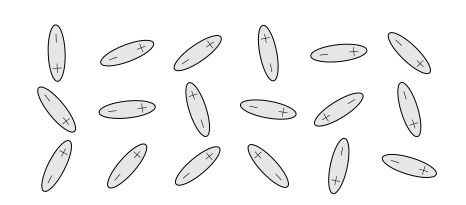
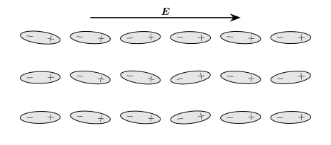



# Electromagnetism in matter {#sec-matter}

::: {.callout-tip}

## Aims of the chapter

By the end of this chapter, you should be able to:

* Understand how electric and magnetic fields behave in matter.

* Derive the corrections to the Maxwell's equations due to matter.

* State Maxwell's equations (and the electromagnetic wave equations) in matter.

* Explain the behaviour of electromagnetic waves at the interface between two dielectric materials.

:::

In all the preceding chapters we have considered the Maxwell's equations in the vacuum. But in most real applications we want to consider, the electric and magnetic fields are not in the vacuum but interact with matter. The aim of this final chapter is to adjust Maxwell's equations to account for the effects of matter.

## Electric fields in matter

We will start by considering electric fields in the presence of a matter, in particular a type of material called _dielectric_. Dielectric materials do not have any charges inside that can move around (they are all held in place).^[Dielectric materials are similar to insulators, which we saw earlier on, but they are not quite the same thing.] But dielectrics, like all matter, are made of atoms and, even though usually these atoms have neutral charge, its components don't: the nucleus has positive charge and the cloud of electrons surrounding it has negative charge. This results in what we call _polarisation_,^[This is different from light polarisation, which we saw in @sec-light-polarisation.] which means that when exposed to an electric field the nucleus gets slightly pushed in one directions and the electrons slightly pushed in the opposite direction. Polarisation has an effect on the electric properties of a material that we will need to take into account.

::: {#fig-material-dipoles layout-ncol=2}

{#fig-unpolarised}

{#fig-polarised}

Diagrams for the dipole alignment for (a) unpolarised materials and (b) polarised materials. When the material is unpolarised the dipoles are randomly oriented. When we apply an electric field to the material (i.e. we polarise it), the dipoles align with the field.
:::

Recall the concept of electric dipole that we introduced in @sec-electric-dipole. We can represent a dielectric medium as a collection of many (many) electric dipoles, as shown in @fig-material-dipoles. Applying the principle of superposition, we can write the potential of the medium as

$$\phi_\mathrm{dipoles}(\bfr) = \frac{1}{4 \pi \epsilon_0} \sum_{i = 1}^{N} \frac{\bfp_i \cdot (\bfr - \bfr_i)}{|\bfr - \bfr_i|^3}.$$

::: {#def-electric-polarisation-density}

## Electric polarisation density

We define the _electric polarisation density_ as a vector field $\bfP(\bfr): \Omega \subseteq \mathbb{R}^3 \to \mathbb{R}^3$ that gives the dipole moment per unit volume at a certain point in space. This is analogous to the electric charge density in @def-charge-density.

:::

With this definition, we can write the potential induced by a given polarisation density as

$$\phi_\mathrm{dipoles}(\bfr) = \frac{1}{4 \pi \epsilon_0} \int_\Omega \frac{\bfP(\bfr') \cdot (\bfr-\bfr')}{|\bfr - \bfr'|^3} \dd V'.$$

Now, by a similar argument to the proof of @lem-div-A-0, we can write

$$\begin{aligned}
\phi_\mathrm{dipoles}(\bfr) &= \frac{1}{4 \pi \epsilon_0} \int_\Omega \nabla' \cdot \left(\frac{\bfP'(\bfr')}{|\bfr - \bfr'|} \right) \dd V' - \frac{1}{4 \pi \epsilon_0} \int_\Omega \frac{\nabla' \cdot \bfP(\bfr')}{|\bfr - \bfr'|} \dd V' \\
&= \frac{1}{4 \pi \epsilon_0} \int_\Omega \frac{-\nabla' \cdot \bfP(\bfr')}{|\bfr - \bfr'|} \dd V',
\end{aligned}$$ {#eq-potential-dipoles}

where in the last step we have used the divergence theorem on the first term, plus the fact that, by definition, $\bfP$ is zero at the boundary of $\Omega$ (and outside of it). 

Comparing the equation above with @eq-electrostatic-potential-charge-density we can see the convenience of defining

$$\rho_\mathrm{bound}(\bfr) = - \nabla \cdot \bfP(\bfr),$$ {#eq-rho-bound}

so we can rewrite @eq-potential-dipoles as

$$ \phi_\mathrm{dipoles}(\bfr) = \frac{1}{4 \pi \epsilon_0} \int_\Omega \frac{\rho_\mathrm{bound}(\bfr')}{|\bfr - \bfr'|} \dd V'.$$

Thus we can interpret $\rho_\mathrm{bound}$ as the _effective_ charge density that produces the electric field @eq-potential-dipoles caused by the dipole distribution. We also observe that @eq-rho-bound looks like Gauss' law but now with $-\bfP/\epsilon_0$ instead of $\bfE$. So how is this related to Gauss' law?

When considering a material, we can define its total charge density $\rho$ (the one appearing in Gauss' law) as the combination of the effective charge density $\rho_\mathrm{bound}$ caused by the polarisation of the dielectric material, plus the free charge density $\rho_\mathrm{free}$ (which is all the other charges that do not arise from polarisation). Then, Gauss' law becomes

$$\nabla \cdot \bfE = \frac{1}{\epsilon_0} \left( \rho_\mathrm{free} + \rho_\mathrm{bound} \right) = \frac{1}{\epsilon_0} \left( \rho_\mathrm{free} - \nabla \cdot \bfP \right).$$

As discussed earlier, we expect that the polarisation density $\bfP$ to be aligned with $\bfE$ everywhere, so we write

$$\frac{1}{\epsilon_0} \bfP = \chi_e \bfE,$$

where $\chi_e$ is a newly introduced parameter called the _electric susceptibility_ of the dielectric material. It's often more convenient to define $\chi_e$ in terms of the _permittivity_ of the material $\epsilon = \epsilon_0 (1 + \chi_e)$, which quantifies the response of the dielectric material to an external electric field.^[Now you see why we called $\epsilon_0$ the permittivity of free space.]

The value of $\epsilon$ depends on many aspects of the material and the electric field, but in most cases we can take it to be approximately constant throughout the material. For vacuum, we have $\epsilon = \epsilon_0$, while for most other materials^[The exceptions are very weird materials in very weird situations, so unless stated otherwise it is safe to assume this is true.] $\epsilon > \epsilon_0$, e.g. for air $\epsilon \approx \epsilon_0$ while for water $\epsilon \approx 80 \epsilon_0$.

Using the permittivity, we can rewrite Gauss' law as

$$\nabla \cdot \left( \epsilon \bfE \right) = \rho_\mathrm{free},$$

which sometimes is written in terms of the quantity $\bfD = \epsilon \bfE$, called the _electric displacement_. Note that, as $\epsilon > \epsilon_0$ the electric field generated by the free charges $\rho_\mathrm{free}$ in a material will be smaller than that generated in the vacuum.

## Magnetic fields in matter

Now let's look how matter affects magnetic fields. In the previous section we used electric dipoles to understand the behaviour of matter under an electric field. Now, we will follow a similar argument but with magnetic dipoles instead. 

Recall, from @eq-vector-potential-magnetic-dipole, that the magnetic potential produced by a dipole is

$$\bfA (\bfr) = \frac{\mu_0}{4 \pi} \frac{\bfm \times \bfr}{|\bfr|^3}.$$ 

This is for a single dipole, but using the principle of superposition we can write

$$\bfA_\mathrm{dipoles} (\bfr) = \frac{\mu_0}{4 \pi} \sum_{i=1}^N \frac{\bfm_i \times (\bfr - \bfr_i)}{|\bfr - \bfr_i|^3}.$$ 

::: {#def-magnetisation-density}

## Magnetisation density

We define the _magnetisation density_ as a vector field $\bfM(\bfr): \Omega \subseteq \mathbb{R}^3 \to \mathbb{R}^3$ that gives the magnetic dipole moment per unit volume at a certain point in space.

:::

Then, we can write the vector potential of a distribution of magnetic dipoles as

$$\bfA_\mathrm{dipoles} (\bfr) = \frac{\mu_0}{4 \pi} \int_\Omega \frac{\bfM(\bfr') \times (\bfr - \bfr')}{|\bfr - \bfr'|^3} \dd V'.$$ 

Now, we can do some manipulation of this expression to obtain

$$\begin{aligned}
\bfA_\mathrm{dipoles} (\bfr) &= \frac{\mu_0}{4 \pi} \int_\Omega \bfM(\bfr') \times \nabla' \left( \frac{1}{|\bfr - \bfr'|} \right)\dd V' \\
&= \frac{\mu_0}{4 \pi} \int_\Omega \left[ \frac{\nabla' \times \bfM(\bfr') }{|\bfr - \bfr'|} - \nabla' \times \left( \frac{\bfM(\bfr')}{|\bfr - \bfr'|} \right) \right] \dd V' \\
&= \frac{\mu_0}{4 \pi} \int_\Omega \frac{\nabla' \times \bfM(\bfr')}{|\bfr - \bfr'|} \dd V' + \frac{\mu_0}{4 \pi} \int_{\partial \Omega} \frac{\bfM(\bfr')}{|\bfr - \bfr'|} \times \bfn \; \dd A' \\
&= \frac{\mu_0}{4 \pi} \int_\Omega \frac{\nabla' \times \bfM(\bfr')}{|\bfr - \bfr'|} \dd V'.
\end{aligned} 
$$ {#eq-vector-potential-magnetic-dipole-derivation}

Here, in the second line we have used the product properties of the curl (@eq-curl-scalar-times-vector), in the third line we have applied @thm-generalised-stokes to the second term, and in the fourth line we have used the assumption that the magnetic dipole moment is zero at the boundary (similar argument to what we did with electric dipoles earlier). Now compare this expression with @eq-vector-potential, we may define

$$ \bfJ_\text{bound}(\bfr) = \nabla \times \bfM,$$ {#eq-J-bound}

and thus rewrite @eq-vector-potential-magnetic-dipole-derivation as

$$\bfA_\mathrm{dipoles}(\bfr) = \frac{\mu_0}{4 \pi} \int_\Omega \frac{\bfJ_\text{bound}(\bfr')}{|\bfr - \bfr'|} \dd V'.$$

In this case $\bfJ_\text{bound}(\bfr)$ represents the _effective magnetising currents_ that generate the magnetic dipoles in the material. These current represents the added-up effect of all the microscopic currents induced by the magnetisation.^[There is a more detailed version of this argument in Chapter 8.2.1 of Tong's book, and here is a [cute animation](https://en.wikipedia.org/wiki/Magnetization#Magnetization_current) in Wikipedia that illustrates it.]

Similarly with charge when we revisited Gauss' law, the current appearing in Ampère's law (@eq-Ampere-law) is made of both the contributions due to the free charges $\bfJ_\text{free}$ and the contributions due to the effective magnetising current $\bfJ_\text{bound}$. Then, Ampère's law becomes

$$ \nabla \times \bfB = \mu_0 (\bfJ_\text{free} + \bfJ_\text{bound}) = \mu_0 \bfJ_\text{free} + \mu_0 \nabla \times \bfM.$$

For most materials, the magnetisation density will align with the magnetic field $\bfB$ such that there is no torque on the dipoles (same argument as with electric dipoles), therefore it is reasonable to write

$$ \bfM = \frac{1}{\mu_0} \frac{\chi_m}{1 + \chi_m} \bfB,$$

where $\chi_m$ (you probably see it coming) is a newly introduced parameter called the _magnetic susceptibility_ of the material. You probably won't be surprised either that we may want to define the _permeability_^[Don't mix it up with the _permittivity_!] of the material $\mu = \mu_0 (1 + \chi_m)$.

Then, we can write

$$\bfM = \frac{\chi_m}{\mu} \bfB,$$ {#eq-M-B}

and therefore Ampère's law can be written as

$$\nabla \times \left( \frac{1}{\mu} \bfB \right) = \bfJ_\text{free},$$ {#eq-Ampere-law-material-static}

which sometimes is written in terms of the quantity $\bfH = \frac{1}{\mu}\bfB$, called the _magnetising field_.

Before finishing the section, let's have a quick discussion about what values can $\chi_m$ take:

* If $-1 < \chi_m < 0$ the material is called **diamagnetic**. This means that the magnetisation of the material opposes the applied magnetic field (i.e. the object is repelled by the magnetic field). Some examples of diamagnetic materials are copper, gold and water.^[Therefore humans are also diamagnetic, as we are made mostly of water.]
* If $\chi_m > 0$ the material is called **paramagnetic**. This means that the magnetisation of the material points in the same direction of the applied magnetic field (i.e. the object is attracted by the magnetic field). Some examples of paramagnetic materials are aluminium or tungsten.
* In some cases, we can have $\bfM \neq \bfzero$ when $\bfB = \bfzero$, so @eq-M-B doesn't hold. These are known as **ferromagnetic** materials. These materials become magnetised very easily by external magnetic fields and, more importantly, remain magnetised long after the field is gone. These are the materials that we commonly know as magnets. Very few elements are ferromagnetic, most notably iron, nickel and cobalt.

There is one final aspect we need to discuss. @eq-Ampere-law-material-static holds for the magnetostatic case, but similarly to what we did in @sec-displacement-current we need to modify it to account for time-dependent fields.

When the fields are time-dependent, the bound charge $\rho_\text{bound}$ no longer sits still but it moves around. Still, it must satisfy the continuity equation @eq-continuity, i.e.

$$\ppt{\rho_\text{bound}} + \nabla \cdot \bfJ_\text{bound} = 0.$$

Recall, from @eq-rho-bound, that $\rho_\text{bound}$ is related to the polarisation density, so we can rewrite @eq-J-bound as

$$\bfJ_\text{bound} = \nabla \times \bfM + \frac{\partial \bfP}{\partial t}.$$

Now we can use a similar argument as before, but starting from the time-dependent Ampère's law @eq-Ampere-law-modified-time-dependence we have

$$\nabla \times \bfB - \mu_0 \epsilon_0 \frac{\partial \bfE}{\partial t} = \mu_0 \left( \bfJ_\text{free} + \bfJ_\text{bound} \right) = \mu_0 \bfJ_\text{free} + \mu_0 \nabla \times \bfM + \mu_0 \frac{\partial \bfP}{\partial t}.$$

Rearranging it in terms of $\bfH$ and $\bfD$ we obtain

$$ \nabla \times \bfH - \frac{\partial \bfD}{\partial t} = \bfJ_\text{free}.$$


## Macroscopic Maxwell's equations

Now we can put together the results of the previous sections into the macroscopic Maxwell's equations. Inside matter, electromagnetic fields are governed by

$$\nabla \cdot \bfD = \rho_\text{free},$$ {#eq-Maxwell-matter-1}
$$\nabla \cdot \bfB = 0,$$ {#eq-Maxwell-matter-3}
$$\nabla \times \bfE = - \frac{\partial\bfB}{\partial t},$$ {#eq-Maxwell-matter-2}
$$\nabla \times \bfH - \frac{\partial \bfD}{\partial t} = \bfJ_\text{free}.$$ {#eq-Maxwell-matter-4}

Note that two of the equations are written using $\bfE$ and $\bfB$, while the other two use $\bfD$ and $\bfH$. Therefore, we need some additional constraints to relate these quantities. However, we have seen that in the simplest case we can write

$$\bfD = \epsilon \bfE, \quad \text{and} \quad \bfB = \mu \bfH.$$

Materials that behave like this are callen _linear materials_, and all the complexity of the material is absorbed into the permittivity $\epsilon$ and the permeability $\mu$, which we assume to be constant. Things are a bit more complicated in real life, and many materials do not behave linearly, but that is out of the scope of this module.^[Ferromagnetic materials are a clear example of materials that do not behave linearly.]

### Boundary conditions {#sec-boundary-conditions-matter}

To conclude this section, we need to talk about what happens at the interface between two dielectric materials, with different permitivities and permeabilities. We already showed in @sec-applications-electrostatics and @sec-applications-magnetostatics that at a surface, electric fields are continuous in the tangent direction but may be discontinuous in the normal direction, and viceversa for magnetic fields. The culprits for those discontinuities were surface charges and currents.

We now want to extend these conditions for electromagnetic fields in matter. To do so, we will repeat the arguments from previous sections, but we will apply them to @eq-Maxwell-matter-1 -- @eq-Maxwell-matter-4. We label the two materials 1 and 2, and the normal vector $\bfn$ is defined to point from material 1 to material 2.

We first apply the pillbox argument to @eq-Maxwell-matter-1, and in the presence of a (free) surface charge $\sigma_\mathrm{free}$ we obtain

$$\bfn \cdot \left(\bfD_2 - \bfD_1\right) = \sigma_\mathrm{free}.$$ {#eq-bc-D-normal}

Similarly, from @eq-Maxwell-matter-3 we obtain 

$$\bfn \cdot \left(\bfB_2 - \bfB_1\right) = 0.$$ {#eq-bc-B-normal}

Now we need to integrate along a close curve that intersects the boundary. From @eq-Maxwell-matter-2 we obtain

$$\bfn \times \left(\bfE_2 - \bfE_1 \right) = \bfzero,$$ {#eq-bc-E-tangent}

while for @eq-Maxwell-matter-4 we obtain

$$\bfn \times \left(\bfH_2 - \bfH_1 \right) = \bfK_\mathrm{free},$$ {#eq-bc-H-tangent}

where $\bfK_\mathrm{free}$ is the surface free current.

Note that we have obtain one condition per field $\bfE$, $\bfD$, $\bfB$ and $\bfH$. Typically we will only use two of them, but we can convert between them using the relevant constraints for the materials we are considering.

## Waves in matter

Let's study now how electromagnetic waves propagate through matter. As we did in @sec-electrodynamics for vacuum, we will constrain to the case where there is no free charge nor current, and we will study only linear materials. Then, Maxwell's equations simplify to

$$\nabla \cdot \left(\epsilon \bfE \right) = 0,$$ {#eq-Maxwell-matter-no-charge-1}
$$\nabla \cdot \bfB = 0,$$ {#eq-Maxwell-matter-no-charge-3}
$$\nabla \times \bfE = - \frac{\partial\bfB}{\partial t},$$ {#eq-Maxwell-matter-no-charge-2}
$$\nabla \times \left( \frac{\bfB}{\mu}\right) = \frac{\partial \left(\epsilon \bfE \right)}{\partial t}.$$ {#eq-Maxwell-matter-no-charge-4}

Applying the same transformations as in @sec-light, we can derive the wave equations

$$\frac{1}{v^2} \frac{\partial^2 \bfE}{\partial t^2} - \nabla^2 \bfE = \bfzero,$$

and

$$\frac{1}{v^2} \frac{\partial^2 \bfB}{\partial t^2} - \nabla^2 \bfB = \bfzero,$$

where the new wave propagation speed is given by $v = (\epsilon \mu)^{-\frac{1}{2}}$. It's not directly obvious from the definitions of $\epsilon$ and $\mu$, but for all materials $v \leq c$, so matter basically slows light down. There are also other interesting effects that we will briefly discuss next. Note that as the relation between variables is linear, we could replace $\bfE$ by $\bfD$ and $\bfB$ by $\bfH$ and the equations would still hold.

We could go through the analysis in @sec-light-polarisation to determine that for a monochromatic plane wave, the polarisation vectors must obey

$$\bfE_0 \cdot \bfk = 0, \quad \bfB_0 \cdot \bfk = 0, \quad \text{and} \quad \omega \bfB_0 = \bfk \times \bfE_0,$$

where the dispersion relation still holds, but now reads $\omega = v k$.


### Reflection and refraction
In @sec-reflection-conductor we studied the reflection of light on a perfect conductor. Now we will consider a similar problem but with two dielectric materials.

Consider two materials: material 1 sits at $x < 0$ and has permittivity $\epsilon_1$ and permeability $\mu_1$, while material 2 sits at $x > 0$ and has permittivity $\epsilon_2$ and permeability $\mu_2$. To simplify the notation, we will assume that $\mu_1 = \mu_2 \approx \mu_0$. 

We send a monochromatic plane wave from $x \to - \infty$ towards the boundary at $x = 0$ at an angle $\theta_\mathrm{I}$. The wave has frequency $\omega_\mathrm{I}$ and wavevector $\bfk_\mathrm{I}$, such that

$$ \bfk_\mathrm{I} = k_\mathrm{I} \cos \theta_\mathrm{I} \bfe_x + k_\mathrm{I} \sin \theta_\mathrm{I} \bfe_z.$$

Then, the incident wave is

$$\bfE_\mathrm{inc} = \bfE_\mathrm{I} e^{i (\bfk_\mathrm{I} \cdot \bfr - \omega_\mathrm{I} t)}.$$

When the wave hits the boundary two things can happen: the wave can be reflected, as we saw in the case of the conductor, or the wave can go through the boundary and be transmitted to the second material. In general both things happen at the same time, so we need to consider the reflected wave and the transmitted wave. The reflected wave takes the form

$$\bfE_\mathrm{ref} = \bfE_\mathrm{R} e^{i (\bfk_\mathrm{R} \cdot \bfr - \omega_\mathrm{R} t)},$$

with

$$\bfk_\mathrm{R} = - k_\mathrm{R} \cos \theta_\mathrm{R} \bfe_x + k_\mathrm{R} \sin \theta_\mathrm{R} \bfe_z,$$

and the transmitted wave takes the form

$$\bfE_\mathrm{trans} = \bfE_\mathrm{T} e^{i (\bfk_\mathrm{T} \cdot \bfr - \omega_\mathrm{T} t)},$$

with

$$\bfk_\mathrm{T} = k_\mathrm{T} \cos \theta_\mathrm{T} \bfe_x + k_\mathrm{T} \sin \theta_\mathrm{T} \bfe_z.$$ {#eq-transmitted-wavevector}

We now need to determine how the amplitude, polarisation, wavevector and frequency of the reflected and transmitted waves relate to those of the incident wave. The overall electric field satisfies

$$\bfE(\bfr, t) = \begin{cases}
\bfE_\mathrm{inc} + \bfE_\mathrm{ref}, & \quad \text{in} \quad x < 0, \\
\bfE_\mathrm{trans}, & \quad \text{in} \quad x > 0.
\end{cases}$$

We can apply the boundary conditions that we derived in @sec-boundary-conditions-matter to the total electric field $\bfE$ to find out the relations between the incident, reflected and transmitted waves.

In fact, we will only need @eq-bc-D-normal. This gives us

$$\bfe_x \cdot \left( \epsilon_2 \bfE_\mathrm{trans} - \epsilon_1 (\bfE_\mathrm{inc} + \bfE_\mathrm{ref} ) \right) = 0,$$

at $x = 0$. It yields

$$\epsilon_2 \bfE_\mathrm{T} \cdot \bfe_x e^{i (k_\mathrm{T} \sin \theta_\mathrm{T} z - \omega_\mathrm{T} t)} - \epsilon_1 \left(\bfE_\mathrm{I} \cdot \bfe_x e^{i (k_\mathrm{I} \sin \theta_\mathrm{I} z - \omega_\mathrm{I} t)} + \bfE_\mathrm{R} \cdot \bfe_x e^{i (k_\mathrm{R} \sin \theta_\mathrm{R} z - \omega_\mathrm{R} t)}\right) = 0.$$

This needs to be satisfied for all $z$ and $t$, so we must have

$$\omega_\mathrm{I} = \omega_\mathrm{R} = \omega_\mathrm{T},$$

and

$$k_\mathrm{I} \sin \theta_\mathrm{I} = k_\mathrm{R} \sin \theta_\mathrm{R} = k_\mathrm{T} \sin \theta_\mathrm{T}.$$

But remember that the frequency and the wave number are related by the dispersion relation $k_j = \omega_j / v_j$ for $j \in \{\mathrm{I}, \mathrm{R}, \mathrm{T}\}$, where $v_j$ is the speed of light in the material. The incident and reflected waves are in material 1, which has a speed of light $v_1 = (\epsilon_1 \mu_1)^{-\frac{1}{2}}$, so combining the two expressions we found above we find

$$\sin \theta_\mathrm{I} = \sin \theta_\mathrm{R},$$

and because $0 \leq \theta_\mathrm{I}, \theta_\mathrm{R} < \pi/2$ (otherwise the wave would be in material 2) the only possiblity is

$$\theta_\mathrm{I} = \theta_\mathrm{R}.$$

This is the law of reflection that we already derived in @sec-reflection-conductor.

Now let's consider the transmitted wave, which is in material 2 and thus travels at a speed $v_2 = (\epsilon_2 \mu_2)^{-\frac{1}{2}}$. Similar to what we just did, we find

$$\frac{\sin \theta_\mathrm{I}}{v_1} = \frac{\sin \theta_\mathrm{T}}{v_2}.$$

Defining the _refractive index_ of a material as $n_j = c / v_j$, we can rewrite the equation above as

$$n_1 \sin \theta_\mathrm{I} = n_2 \sin \theta_\mathrm{T},$$ {#eq-Snell}

which is known as _Snell's law_ (or law of refraction).

But we can go even further and determine the amplitude and polarisation of the reflected and transmitted waves. It all depends on the polarisation of the incident wave, and we will consider two different cases: normal polarisation and parallel polarisation.

### Polarisation

Let's first consider the case when the incident wave is polarised perpendicularly to the plane of incidence (i.e. the plane defined by the incident wavevector and the normal vector to the boundary). In this case, we can write $\bfE_\mathrm{I} = E_\mathrm{I} \bfe_y$. Given that the electric field must oscillate in the plane perpendicular to the wavevector and (assuming that $\epsilon_1 \neq \epsilon_2$) the incident wavevector is linearly independent with the transmitted wavevector, we must have that $\bfE_\mathrm{R} = E_\mathrm{R} \bfe_y$ and $\bfE_\mathrm{T} = E_\mathrm{T} \bfe_y$. Now using @eq-bc-E-tangent we obtain

$$E_\mathrm{I} + E_\mathrm{R} = E_\mathrm{T}.$$

Consider now the corresponding magnetic fields. They must oscillate in the direction $\bfk_j \times \bfe_y$, for $j \in \{\mathrm{I}, \mathrm{R}, \mathrm{T}\}$. Then, we can write $\bfB_\mathrm{I} = B_\mathrm{I} \left(- \sin \theta_\mathrm{I} \bfe_x + \cos \theta_\mathrm{I} \bfe_z \right)$, and similarly for the other magnetic fields.^[Be careful with $\bfB_\mathrm{R}$, as we defined the angle differently and thus there is a sign change!]

We now take @eq-bc-B-normal and @eq-bc-H-tangent. Because we assumed $\mu_1 = \mu_2 \approx \mu_0$ we can replace $\bfH$ with $\bfB$. Then

$$\begin{aligned}
\bfe_x \cdot \left( \bfB_\mathrm{T} - (\bfB_\mathrm{I} + \bfB_\mathrm{R})\right) = 0,\\
\bfe_x \times \left( \bfB_\mathrm{T} - (\bfB_\mathrm{I} + \bfB_\mathrm{R})\right) = \bfzero,
\end{aligned}$$

and this is only possible if

$$\bfB_\mathrm{T} - (\bfB_\mathrm{I} + \bfB_\mathrm{R}) = \bfzero.$$

Splitting into $x$ and $z$ components we obtain

$$\begin{aligned}
B_\mathrm{I} \sin \theta_\mathrm{I} + B_\mathrm{R} \sin \theta_\mathrm{R} &= B_\mathrm{R} \sin \theta_\mathrm{T},\\
B_\mathrm{I} \cos \theta_\mathrm{I} - B_\mathrm{R} \cos \theta_\mathrm{R} &= B_\mathrm{R} \cos \theta_\mathrm{T}.
\end{aligned}$$

The first equation yields, again, $E_\mathrm{I} + E_\mathrm{R} = E_\mathrm{T}$. Using $\theta_\mathrm{I} = \theta_\mathrm{R}$ and that $E_j$ and $B_j$ are related by the speed of light, we can turn the second equation into

$$\frac{E_\mathrm{I} - E_\mathrm{R}}{v_1} \cos \theta_\mathrm{I} = \frac{E_\mathrm{T}}{v_2} \cos \theta_\mathrm{T}.$$

With Snell's law and a bit of patience, we obtain

$$\frac{E_\mathrm{R}}{E_\mathrm{I}} = \frac{n_1 \cos \theta_\mathrm{I} - n_2 \cos \theta_\mathrm{T}}{n_1 \cos \theta_\mathrm{I} + n_2 \cos \theta_\mathrm{T}}, \quad \text{and} \quad \frac{E_\mathrm{T}}{E_\mathrm{I}} = \frac{2 n_1 \cos \theta_\mathrm{I}}{n_1 \cos \theta_\mathrm{I} + n_2 \cos \theta_\mathrm{T}}.$$

These are the _Fresnel equations_ for normal polarised light (sometimes also called _s-polarised_ light).

This equation tells us, for example, that if the incident wave is parallel to the interface (i.e. $\theta_\mathrm{I}$), nothing is transmitted. If the wave hits the interface perpendicularly, then $2n_1/(n_1 + n_2)$ of the wave is transmitted and $(n_1-n_2)/(n_1+n_2)$ is reflected. For example, if material 1 is air ($n_1 \approx 1$) and material 2 is glass ($n_2 \approx 1.5$), the relative amplitudes as a function of the incident angle are shown in @fig-normal-polarisation.

```{python}
#| echo: false
#| label: fig-normal-polarisation
#| fig-cap: "Relative amplitudes of the reflected and transmitted waves with normal polarisation."

import matplotlib.pyplot as plt
import numpy as np

plt.rcParams['text.usetex'] = True

fig, ax = plt.subplots(1, 2, figsize=(6,3))

n_1 = 1
n_2 = 1.5

theta_T_fun = lambda x: np.arcsin(n_1/n_2 * np.sin(x))

theta_I = np.linspace(0, np.pi/2)
theta_T = theta_T_fun(theta_I)

# Make plot for reflected wave
ax[0].plot(theta_I, (n_1*np.cos(theta_I) - n_2*np.cos(theta_T))/(n_1*np.cos(theta_I) + n_2*np.cos(theta_T)))
ax[0].set_xlabel(r"$\theta_\mathrm{I}$")
ax[0].set_ylabel(r"$E_\mathrm{R}/E_\mathrm{I}$")

# Make plot for trasmitted wave
ax[1].plot(theta_I, 2*n_1*np.cos(theta_I)/(n_1*np.cos(theta_I) + n_2*np.cos(theta_T)))
ax[1].set_xlabel(r"$\theta_\mathrm{I}$")
ax[1].set_ylabel(r"$E_\mathrm{T}/E_\mathrm{I}$")
plt.tight_layout()
plt.show()
```

Now let's consider the case when the incident wave is polarised parallel to the plane of incidence. In this case, we can write $\bfE_\mathrm{I} = E_\mathrm{I} \left( \sin \theta_\mathrm{I} \bfe_x - \cos \theta_\mathrm{I} \bfe_z \right)$, and similarly for the other electric fields. Then, using @eq-bc-E-tangent we obtain

$$E_\mathrm{I} \cos \theta_\mathrm{I} + E_\mathrm{R} \cos \theta_\mathrm{R} = E_\mathrm{T} \cos \theta_\mathrm{T}.$$

Using @eq-bc-D-normal written in terms of the electric fields, we obtain

$$\epsilon_1 E_\mathrm{I} \sin \theta_\mathrm{I} - \epsilon_1 E_\mathrm{R} \sin \theta_\mathrm{R} = \epsilon_2 E_\mathrm{T} \sin \theta_\mathrm{T}.$$

Now the magnetic field is in perpendicular to the plane of incidence, i.e. points in the $y$-direction. From @eq-bc-H-tangent we obtain

$$B_\mathrm{I} - B_\mathrm{R} = B_\mathrm{T},$$

hence 

$$\frac{E_\mathrm{I} - E_\mathrm{R}}{v_1} = \frac{E_\mathrm{T}}{v_2}.$$

Combining everything we obtain

$$\frac{E_\mathrm{R}}{E_\mathrm{I}} = \frac{n_1 \cos \theta_\mathrm{T} - n_2 \cos \theta_\mathrm{I}}{n_1 \cos \theta_\mathrm{T} + n_2 \cos \theta_\mathrm{I}}, \quad \text{and} \quad \frac{E_\mathrm{T}}{E_\mathrm{I}} = \frac{2 n_1 \cos \theta_\mathrm{I}}{n_1 \cos \theta_\mathrm{T} + n_2 \cos \theta_\mathrm{I}}.$$

These are, again, the _Fresnel equations_ but now for parallel polarised light (sometimes called _p-polarised_ light). In the cases where the incident wave is parallel or perpendicular to the interface, the Fresnel equations for parallel and normal polarised light coincide, but otherwise they are different. Again, for air and glass, the relative amplitudes as a function of the incident angle are shown in @fig-parallel-polarisation.

```{python}
#| echo: false
#| label: fig-parallel-polarisation
#| fig-cap: "Relative amplitudes of the reflected and transmitted waves with parallel polarisation."

import matplotlib.pyplot as plt
import numpy as np

plt.rcParams['text.usetex'] = True

fig, ax = plt.subplots(1, 2, figsize=(6,3))

n_1 = 1
n_2 = 1.5

theta_T_fun = lambda x: np.arcsin(n_1/n_2 * np.sin(x))

theta_I = np.linspace(0, np.pi/2)
theta_T = theta_T_fun(theta_I)

# Make plot for reflected wave
ax[0].plot(theta_I, (n_1*np.cos(theta_T) - n_2*np.cos(theta_I))/(n_1*np.cos(theta_T) + n_2*np.cos(theta_I)))
ax[0].set_xlabel(r"$\theta_\mathrm{I}$")
ax[0].set_ylabel(r"$E_\mathrm{R}/E_\mathrm{I}$")

# Make plot for trasmitted wave
ax[1].plot(theta_I, 2*n_1*np.cos(theta_I)/(n_1*np.cos(theta_T) + n_2*np.cos(theta_I)))
ax[1].set_xlabel(r"$\theta_\mathrm{I}$")
ax[1].set_ylabel(r"$E_\mathrm{T}/E_\mathrm{I}$")
plt.tight_layout()
plt.show()
```

The parallel polarised case has a very interesting property. In that case, there is a certain incident angle for which the reflected wave is zero, i.e. all the light is transmitted. This angle is called the _Brewster angle_, $\theta_\mathrm{B}$ and it is given by

$$\tan \theta_\mathrm{B} = \frac{n_2}{n_1}.$$

For example, if material 1 is air and material 2 is glass, we have $\theta_\mathrm{B} \approx 56^{\circ}$.

This phenomenon gives us a simple way to created polarised light: if you shine unpolarised light on a dielectric precisely at an angle $\theta_\mathrm{B}$ the reflected wave will have normal polarisation.

### Total internal reflection

Now let's return to Snell's law (@eq-Snell). Rearranging it, we have that

$$\sin \theta_\mathrm{T} = \frac{n_1}{n_2} \sin \theta_\mathrm{I}.$$

Note that, if $n_1 > n_2$, the right hand side of the equation could be greater than one, and therefore there is no $\theta_\mathrm{T}$ that satisfies the equation. This means that there is no transmitted wave and all the wave is reflected, a phenomenon called _total internal reflection_.^[That's how optic fibres work.] For a given pair of materials, we can define the critical incidence angle (i.e. the angle above which there is no transmitted wave) as

$$\sin \theta_\mathrm{C} = \frac{n_2}{n_1}.$$

If now material 1 is glass and material 2 is air, we find that $\theta_\mathrm{C} \approx 42^{\circ}$.

There is final remark we need to make. If you compute the amplitude of the transmitted wave, you will notice that the amplitude is non-zero beyond the critical angle. Why is that?

We need to go back to the expression for the transmitted wavevector (@eq-transmitted-wavevector). The interface condition gave us

$$\bfk_\mathrm{T} \cdot \bfe_z = \bfk_\mathrm{I} \cdot \bfe_z = \frac{\omega_\mathrm{I}}{v_1} \sin \theta_\mathrm{I},$$

where we rewrote it in the last step for convenience. Note though that $\omega_\mathrm{I} = \omega_\mathrm{T} = \omega$. From we dispersion relation, we also know that

$$|\bfk_\mathrm{T}| = \frac{\omega}{v_2}.$$

Then, the horizontal component of the transmitted wavevector is

$$\begin{aligned}
\bfk_\mathrm{T} \cdot \bfe_x &= \pm \sqrt{|\bfk_\mathrm{T}|^2 - (\bfk_\mathrm{T} \cdot \bfe_z)^2}\\
&= \pm \frac{\omega}{v_2} \sqrt{1 - \frac{v_2^2 \sin^2 \theta_\mathrm{I}}{v_1^2}}\\
&= \pm \frac{\omega}{v_2} \sqrt{1 - \frac{n_1^2 \sin^2 \theta_\mathrm{I}}{n_2^2}}.
\end{aligned}$$

When $\theta_\mathrm{I} > \theta_\mathrm{C}$, the $x$-component of the wavevector is imaginary! Setting $\bfk_\mathrm{T} \cdot \bfe_x = \pm i \omega \alpha / v_2$ (where $\alpha$ absorbs the square root) we find that the transmitted wave is

$$\bfE_\mathrm{trans} = \bfE_\mathrm{T} e^{i(z \bfk_\mathrm{T} \cdot \bfe_z - \omega t)} e^{\mp \omega \alpha x/v_2},$$

for $x > 0$. The plus sign in the exponent give an exponential blow-up in the wave, which is not physical. Therefore, the only physical solution is the one with the minus sign, which gives an exponential decay in the wave. This is called an _evanescent wave_, and it is responsible for the non-zero amplitude of the transmitted wave beyond the critical angle. The evanescent wave does not propagate energy into material 2, but it can still interact with objects that are close enough to the boundary.